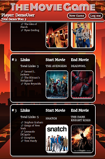

<h1>The Movie Game</h1>

<h2>Summary</h2>

<a href="https://themoviegame.netlify.com">The Movie Game</a> is a fun puzzle game that tests players knowledge of movies and movie casts.

Begin by selecting both a starting and ending movie.  Players will then alternate selecting cast members and movies until reaching the end.

Players will choose a cast member from the current movie.  Then players choose a movie that cast member was in and so on.

The goal is to reach the end movie in the least amount of links.  After players win, they will see some fun facts about the movie and cast.

Players can then look at past games in their dashboard and try to beat earlier scores.

<h2>API</h2>

The Movie Game uses The Movie DB api with a proxy server.

The proxy server can be found<a href="https://github.com/SMuyesser/themoviegame-api"> here</a>.

<h2>Images</h2>
 |  | 

<h2>Technology</h2>
<h3>Front End</h3>
<ul>
  <li>HTML5</li>
  <li>CSS3</li>
  <li>JavaScript</li>
  <li>React</li>
  <li>Redux</li>
  <li>Redux Form</li>
</ul>
<h3>Fully Responsive for all devices</h4>
<h3>Back End</h3>
<ul>
  <li>Node.js + Express.js (web server)</li>
  <li>MongoDB (database)</li>
  <li>Mongoose</li>
  <li><a href="https://mochajs.org/">Mocha</a> + <a href="http://chaijs.com/">Chai</a> (testing)</li>
  <li>Enzyme (testing)</li>
  <li>Continuous integration and deployment with <a href="https://travis-ci.org/">Travis CI</a></li>
</ul>
<h3>Security</h3>
<ul>
  <li>Player passwords are encrypted using <a href="https://github.com/dcodeIO/bcrypt.js">bcrypt.js</a>.</li>
  <li><a href="http://passportjs.org/">Passport</a> is used to control endpoints from unauthorized users.</li>
</ul>
