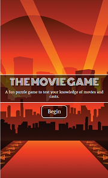
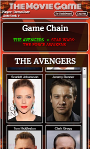

<h1>The Movie Game</h1>

<h2>Summary</h2>

<a href="https://themoviegame.netlify.com">The Movie Game</a> is a fun puzzle game that tests your knowledge of movies and movie casts.

Begin by selecting both a starting and ending movie.  You will then alternate selecting cast members and movies until reaching the end.

You will choose a cast member from the current movie.  Then you choose a movie that cast member was in and so on.

The goal is to reach the end movie in the least amount of links.  After you win, you will see some fun facts about the movie and cast.

You can then look at past games in your dashboard and try to beat your earlier scores.

Most important! Have fun

<h2>API</h2>

The Movie Game uses The Movie DB api with a proxy server.

The proxy server can be found<a href="https://github.com/SMuyesser/themoviegame-api"> here</a>.

<h2>Images</h2>

<h2>Technology</h2>
<h3>Front End</h3>
<ul>
  <li>HTML5</li>
  <li>CSS3</li>
  <li>JavaScript</li>
  <li>React</li>
  <li>Redux</li>
  <li>Redux Form</li>
</ul>
<h3>Fully Responsive for all devices</h4>
<h3>Back End</h3>
<ul>
  <li>Node.js + Express.js (web server)</li>
  <li>MongoDB (database)</li>
  <li>Mongoose</li>
  <li><a href="https://mochajs.org/">Mocha</a> + <a href="http://chaijs.com/">Chai</a> (testing)</li>
  <li>Enzyme (testing)</li>
  <li>Continuous integration and deployment with <a href="https://travis-ci.org/">Travis CI</a></li>
</ul>
<h3>Security</h3>
<ul>
  <li>Player passwords are encrypted using <a href="https://github.com/dcodeIO/bcrypt.js">bcrypt.js</a>.</li>
  <li><a href="http://passportjs.org/">Passport</a> is used to control endpoints from unauthorized users.</li>
</ul>
